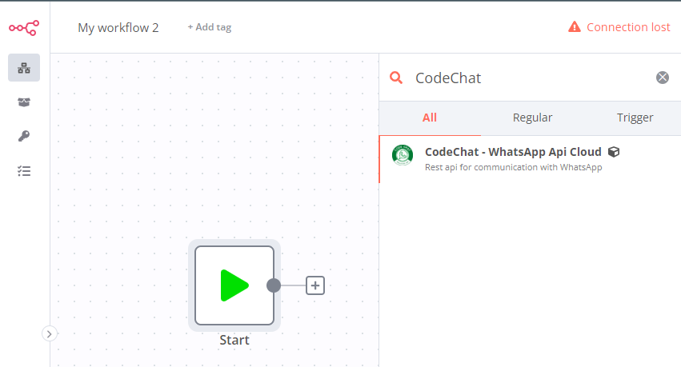
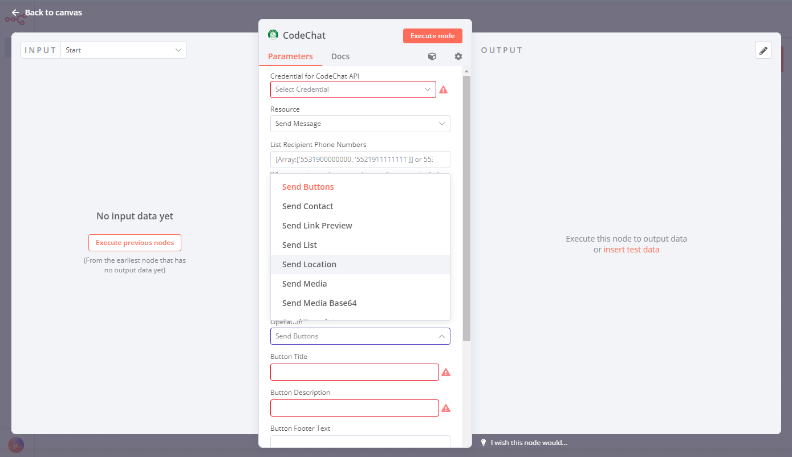
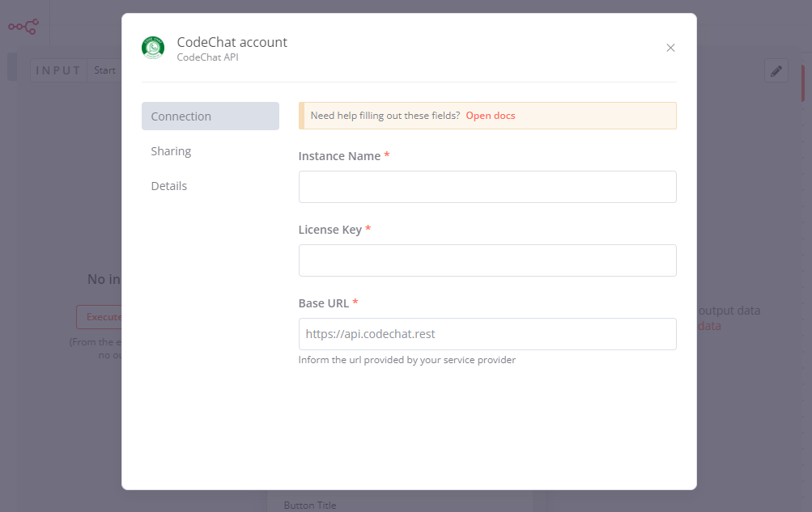

[](https://t.me/codechatBR)
[](https://api.whatsapp.com/send?phone=5531995918699)


# n8n-nodes-codechat

This is a [N8n](https://community.n8n.io/) community node. It allows you to use CodeChat Api to communicate with WhatsApp in your workflow.

You can use most features provided by CodeChat. Like sending messages, creating and manipulating groups and managing chats.

# Instalation

1. Go to **Settings** > **Community Nodes**, and Click Install a community node.


2. Enter `n8n-nodes-codechat` in the **npm Package Name** field. And click **Install**.


Once installed, you can use the search bar to add the CodeChat node to your workflow.




# Usage

Node configuration is quite simple, just specify the credentials and use the available resources and operations.

# Credentials

All operations require a credential which is composed of the **License**, **Instance Name** and the call **Base Url**. Which will be made available at the time of contracting the service.


# Resources

This section describes which **CodeChat API** operations are available on this node.

## Resource Send Message

| Operation           | Method | Credentials required |
| --------------------|--------|----------------------|
| Send Text           | POST   | True                 |
| Send Buttons        | POST   | True                 |
| Send Template       | POST   | True                 |
| Send Media          | POST   | True                 |
| Send Media Base64   | POST   | True                 |
| send Link Preview   | POST   | True                 |
| Send Contact        | POST   | True                 |
| Send List           | POST   | True                 |
| Send WhatsApp Audio | POST   | True                 |

All operations return a queue for tracking the shipment that can be monitored through the webhook.

```json
{
 "header": {
  "queueId": "20aa6e5f-4545-4f90-b712-9a176c9509da",
  "status": "PROCESSING",
  "progress": 0
 },
 "data": {
  "jids": [
   "5531900000000@s.whatsapp.net"
	]
 }
}
```

## Resource Group

| Operation              | Method | Credentials required | Description                                                   |
| -----------------------|--------|----------------------|---------------------------------------------------------------|
| Accept Invite          | PUT    | True                 | Accept incoming group invite                                  |
| Change Expiration      | PUT    | True                 | Sets the expiration of group messages                         |
| Create Group           | POST   | True                 |                                                               |
| Fetch Participants     | GET    | True                 |                                                               |
| Group Metadata         | GET    | True                 | Retrieve all information about the group and its participants |
| Invite Code            | GET    | True                 | Generates the created group invitation                        |
| Revoke Invite          | PUT    | True                 |                                                               |
| Update Info            | PUT    | True                 |                                                               |
| Update Participants    | PUT    | True                 |                                                               |
| Update Profile Picture | PUT    | True                 |                                                               |
| Update Settings        | PUT    | True                 | Update group chat and group handling rules                    |

# Resource Chat

| Operation            | Method | Credentials required | Description                           |
|----------------------|--------|----------------------|---------------------------------------|
| Block Contact        | PUT    | True                 |                                       |
| Business Profile     | GET    | True                 | Retrieve business contact information |
| Mark Message As Read | PUT    | True                 |                                       |
| On WhatsApp          | POST   | True                 | Check if the contact is on WhatsApp   |
| Profile Picture Url  | GET    | True                 | Retrieve a contact's profile picture  |
| Update Presence      | PUT    | True                 |                                       |
| Update Status        | PUT    | True                 |                                       |

# Compatibility

Tested on n8n version 0.198.2 and CodeChat version 2.0.0

## License

[MIT](https://github.com/code-chat-br/n8n-node-codechat/blob/main/LICENSE.md)
